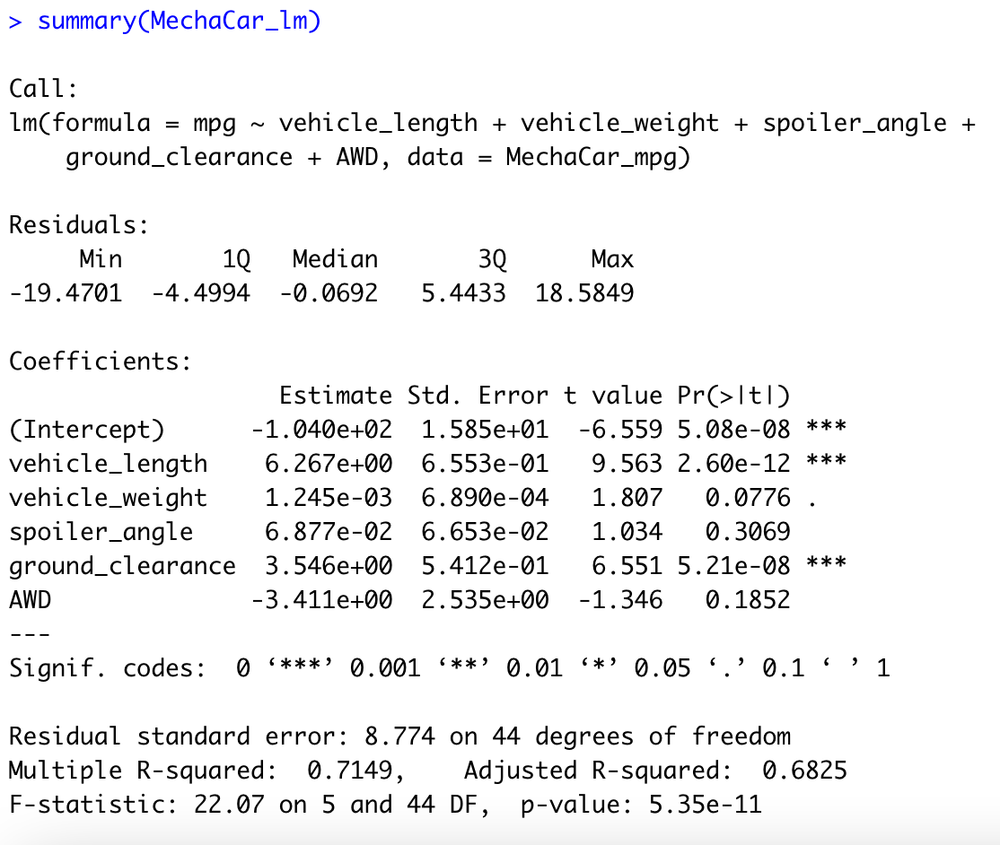

# MechaCar-Statistical-Analysis

## Overview of Analysis

The purpose of this project is to help AutosRUs’ newest prototype, the MechaCar, from production troubles that are blocking the manufacturing team’s progress. The project will focus on reviewing the production data for insights that may help the manufacturing team.

## Results

The data preparation utilizes R and statistics to analyze and create analysis and reports. The results are generated on the <a href="MechaCarChallenge.RScript.R">R Script</a>. 

## Deliverable 1: Linear Regression to Predict MPG

This analysis focuses on analyzing the test results for 50 prototypes of Mechacars to identify ideal vehicle performance. 

**Which variables/coefficients provided a non-random amount of variance to the mpg values in the dataset?**

Based on the summary calculations, the vehicle length and ground clearance variables are statistically likely to provide non-random amount of variance to the mpg values in the dataset. This is due to the small p-values.

However, the vehicle weight, spoiler angle, and all wheel drive (AWD) are statistically likely to provide random amount of variance due to the larger p-value.

**Is the slope of the linear model considered to be zero? Why or why not?**

The slope is not considered to be zero because the p-value is 5.35-11 which is significantly smaller than assumed significance level of 0.05%. This would allow us to reject the null hypothesis which indicates that the linear model is zero. 

**Does this linear model predict mpg of MechaCar prototypes effectively? Why or why not?**

This linear model predicts mpg oof MechaCar prototypes effectively because the multiple r-squared is 0.7149. This indicates that the model will correctly predict  approximately 71.49%.

## Deliverable 2: Summary Statistics on Suspension Coils

In this dataset, we are analyzingn the weight capacities of multiple suspension coils to determine if the manufacturing process is consistent across production lots. 

The summary for all manufacturing lots is listed below:

The summary for each lot is listed below:

**Does the current manufacturing data meet this design specification for all manufacturing lots in total and each lot individually? Why or why not?**

When reviewing the entire manufacturinng lot, the manufacturing data meets the design specification because the variance of the coils is 62.29 PSI, which is well within the 100 PSI variance requirement.

When reviewing the individual manufacturing lots, Lot 1 and Lot 2 are within the 100 PSI variance requirement of 0.97 and 7.49. Whereas Lot 3 is showing a much larger variance with a variance of 170.29 which showcases that Lot 3 is not operating within the design specifications.

## Deliverable 3: T-Tests on Suspension Coils 

This analysis uses t-tests to determine if all manufacturing lots and each lot individually are statistically different from the population mean of 1,500 pounds per square inch.

**Key Findings**

Based on the t-test analysis for all manufacturing lotos, it shows that the true mean of the sample is 1498.78 and a p-value of 0.06. This is higher than the common signifigance level of 0.05. 

However, when looking at each of the individua lots, Lot 1 has a sample mean oof 1500 and a p-value of 1. We canno reject the null hypothesis as there is no statistical difference between the observed sample mean and the population mean of 1500.

In Lot 2, the sample mean is 1500.02 and p-value of 0.61. The observed sample mean is also almost the exact same as the population mean which provides no reason to reject the null hypothesis.

Lastly, in Lot 3, the sample mean iis 1496.14 with a p-value of 0.04. The p-value is lower than the common signifigance level which indicates that we should reject the null hypothesis.

## Deliverable 4: Study Design: MechaCar vs Competition

After completiing multiple statistical studies to compare performance of the MechaCar vehicles against performance of vehicles from other manufacturers, a complete study between MechaCar and its competitors can be completed.

**What metric or metrics are you going to test?**

A few metrics that would be necessary to test would be: cost, city or highway fuel efficiency, horse power, maintenance cost, safety rating, enginne type, selling price and other upgrade features (types of seats, wheels, etc).

**What is the null hypothesis or alternative hypothesis?**

Null Hypothesis: MechaCars have no difference in pricing compared to its competitors based on its perforamce of key factors.

Alternative Hypothesis: MechaCars have different pricing in comparison to competitors based onn its performance of key factors.

**What statistical test would you use to test the hypothesis? And why?** 

A multiple linear regression test can be used to determine the factors that have the highest correlation and/or predictability with a dependent factor like the selling price. This can determine which combination has the greatest impact on price.

**What data is needed to run the statistical test?**
In order to carry out this statistical test, we will need to get data on each of the metrics from MechaCar and its competitors.